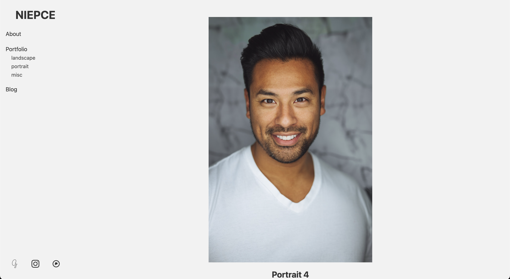

# Niepce

An Eleventy Starter kit for a portfolio site.

## What is Niepce?

It's a starter kit to help you build you own static portfolio website without having to do everything from scratch yourself.

It's ready to be build as it is but you'll have to set some things up to make it your own.

## Demo

Currently used on my own [portfolio](https://www.bloogart.com/) but this tool comes with several example pages so you can quickly serve locally and see it in action if you want to start playing with it immediately.

_NB: Note that most of example pictures are from Unsplash.com and are credited in their own page._

## What kind of features to expect

### Dark and light theme

You'll be able to choose between a dark theme, a light theme or let it be automatic and let the user's preferences choose for you.

#### Dark theme


#### Light theme


### Choose your grid

There's 4 types of grid for your home or your tag pages and it doesn't have to be the same for both.

#### Justified

Like Flickr or 500px.


#### Masonry

Like Pinterest.


#### Instagrid

Like Instagram.


#### Monocolumn

No grid, just pictures after pictures.



### Display EXIF metadata

You can choose to display the EXIF metadata or not.

The metadata displayed (if available) are:

- camera's brand and model
- shutter speed
- focal length
- aperture
- ISO
- date of when the picture was taken

### Display tags

Display tags or not on post pages.

If you tag your photo with only one tag it may be not relevant to show it on the post page, in that case you can choose to hide it.

### External links

You have the ability to add any external links in the menu and even more, if you have social networks accounts, you'll be able to easily add your links.

## How to setup your portfolio

First things first, clone or download this repository. Once you have it on your computer it's time to start coding.

### Configuration

This starter kit being an eleventy project has to be setup like an eleventy project.

First, edit the file `_data/metadata.json` file.
You'll want to edit it all with your own information.

```json
{
	"title": "Niepce",
	"url": "https://portfolio.niepce.tld",
	"language": "en",
	"locale": "en_US",
	"description": "Niepce's personal portfolio",
	"author": {
		"name": "Nicéphore Niépce",
		"email": "nicephore@niepce.tld",
		"url": "https://www.niepce.tld"
	}
}
```

Then it's time to choose your theme preferences, to do so open the `_data/niepce.js` file and edit it as you see fit.

```js
module.exports = {
	grid: "masonry",
	grid_tags: "justified",
	theme: "auto",
	logo: "",
	banner: "",
	exif: true,
	tags: true,
	socials: {
		"500px": "",
		behance: "",
		deviantart: "",
		flickr: "",
		glass: "https://glass.photo/gooz",
		instagram: "https://www.instagram.com/gooz/",
		notos: "",
		pixelfed: "https://pixelfed.social/i/web/profile/422334934806983747",
		tumblr: "",
	},
	links: [
		{
			label: "Blog",
			url: "https://blog.foojin.com",
		},
	],
}
```

**Key** `grid`\
**Value** `masonry | justified | instagrid | monocolumn`\
_It's your grid choice for your home and tag pages._

**Key** `grid_tags`\
**Value** `masonry | justified | instagrid | monocolumn`\
_Grid of choice for your tag pages. If undefined, the tag pages will display the same grid as the home page._

**Key** `theme`\
**Value** `light | dark | auto`\
_Choosing a specific theme will enforce it for everyone but choosing `auto` will display one or the other depending on the user preferences._

**Key** `logo`\
**Value** `String`\
_Path to your logo (any image format that can be displayed in a HTML `img` tag). It can be anywhere, even remote. If there's no logo provided then the title you provided in the `metadata.json` will be displayed instead._\
_If it's a SVG and you want it inlined so it's color change with the theme, add a suffix "-inline" to its filename (e.g. logo-inline.svg)_

**Key** `banner`\
**Value** `String`\
_Path to your site banner (any image format that can be displayed in a HTML `img` tag). It can be anywhere, even remote. This image will only be used in [OpenGraph](https://ogp.me/) tags unless you decide to use it somewhere else._

**Key** `exif`\
**Value** `boolean`\
_Display or not the exif metadata of your pictures on the post page. If `true` and some exif metadata are not available, only those that are available will be displayed._

**Key** `tags`\
**Value** `boolean`\
_Display or not the tags of the picture on the post page_

**Key** `social`\
**Value** `Key (String): Value (String)`\
_Only the social networks with links provided will be displayed._\
_Note that if needed you can add an unlisted social network but if you want to do so you will need to add its own SVG icon in the `public/img/sprite` folder and name it exactly as the **key** used here._

**Key** `links`\
**Value** `Key (String): Value (String)`\
_If you want to add external links in your menu that's the way to go, provide a new object in the array with a label and an URL._

There you go, you're ready to build your portfolio.

### Environment setup

_Prerequisites:_
You'll need [NPM](https://www.npmjs.com/) installed on your computer

Now, in your terminal, go into the repository and type…

```shell
npm install
```

It will install all the needed dependencies to run and build your portfolio. Now let's start a server to see how it looks like…

```shell
npm run start
```

This command will build the portfolio and run a local web server to test the website.

Once the server tells you…

```shell
[11ty] Watching…
[11ty] Server at http://localhost:8080/
```

It means you can open the http://localhost:8080/ URL in your browser.

_N.B.: the first time you run the command it will take some time, it's normal. There's a few post examples with pictures already and the build needs to process those._

### Creating your own post and pages

Now that your website is up and running you can add your own content.\
Any content you want to add needs to be in the `content` folder, if you take a look, there's already some stuff in it.

The folders inside are posts examples and the `about.md` a standalone page example.\
Feel free to trash those (except maybe `feeds` & `sitemap`) when you familiarized yourself with how to create posts and pages **but you should not delete the other files** (unless you know what you're doing.)

The only specific thing to know about post and pages are the data you set in the _frontmatter_, the data at the top of the markdown files.

```
---
title: Title of the post
date: 2023-09-20
photo: photo.jpg
photo_alt: Portrait
tags:
  - portrait
---
```

This is where you set the title, date of the post (not the photo), file of the photo (and its alternative text) and the tags of the post.\
That's about it.

### Deployment

By now you should have a running portfolio with your own content… but it's only local, on your computer.

You need to find yourself a hosting provider who serves static files (which should be every provider actually) and have NodeJS (>=16) installed as well.

Once this is done, you need to run `npm i && npm run build` to install the dependencies and build your site, then point the Apache config to the folder `_site`, this is where your portfolio is generated and what should be served. Everything else is just there to generated this folder.

## Final words

For those of you wondering, the name **Niepce** comes from [Nicéphore Niépce](https://en.wikipedia.org/wiki/Nic%C3%A9phore_Ni%C3%A9pce), one of the earliest pioneers of photography.

If you face any problem of have any question, feel free to drop an [issue](https://github.com/GoOz/Niepce/issues).
