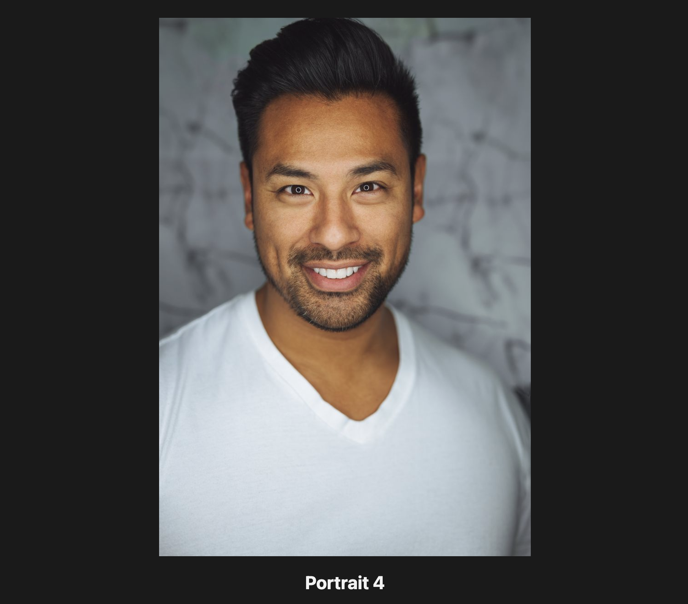

# Niepce

An Eleventy Starter kit for a portfolio site.

## What is Niepce?

It's a starter kit to help you build you own static portfolio or art gallery website without having to do everything from scratch yourself.

It's ready to be build as it is but you'll have to set some things up to make it your own.

## Documentation
There's evyerthing you need to know about Niepce on the [wiki](https://github.com/GoOz/Niepce/wiki).  
How to install, to fine tune, the tips & tricks…

## Demo

You can take a look at the [demo website](https://gooz.github.io/Niepce/) to see a dummy example or you can look at my own [portfolio](https://gooz.photography/) which is using Niepce as well.  
Niepce comes with several example pages so you can quickly serve locally and see it in action if you want to start playing with it immediately.

> [!NOTE]
> Note that most of example pictures are from [Unsplash.com](https://www.unsplash.com) and are credited in their own dedicated page.

## What kind of features to expect
> [!NOTE] 
> All of the features below are optional.

### Dark and light theme

You'll be able to choose between a dark theme, a light theme or let it be automatic and let the user's preferences choose for you.

#### Dark theme

#### Light theme

### Splash screen
A splash screen as the first screen a visitor will see where the pictures of your choice will be displayed one after another in a smooth slideshow animation.

### Choose your grid

There's 4 types of grid for your lists of pictures:

#### Justified

Like **Flickr** or **500px**.

#### Masonry

Like **Pinterest**.

#### Instagrid

Like **Instagram**.

#### Monocolumn

No grid, just pictures after pictures.

### Display EXIF metadata

You can choose to display the EXIF metadata or not.

The metadata displayed (if available) are:

- camera's brand and model
- shutter speed
- focal length
- aperture
- ISO
- date of when the picture was taken

### Selling prints

Whether you have your own selling platform or you prefer to deal with it yourself by hand, you can add a link to buy a print of a picture and manually maintain your available stock.

### And more…
There's a lot of other tiny features available, check the [wiki](https://github.com/GoOz/Niepce/wiki) for more informations.

## Final words

For those of you wondering, the name **Niepce** comes from [Nicéphore Niépce](https://en.wikipedia.org/wiki/Nic%C3%A9phore_Ni%C3%A9pce), one of the earliest pioneers of photography.

If you face any problem of have any question, feel free to drop an [issue](https://github.com/GoOz/Niepce/issues).

Credits for the photography in the social media preview goes to [Zalfa Imani](https://unsplash.com/fr/@zalfaimani).
